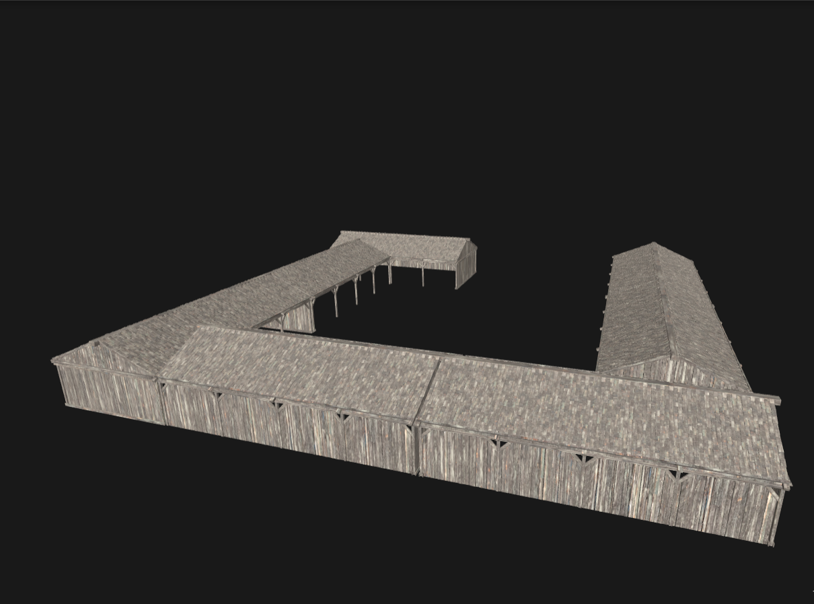

# Front-end developer test server: API

The API server serves the following static assets:

## /planarific.webp


TOKEN required: **yes**

The Planarific logo.

Example request:

```
curl -H "Authorization: Bearer SUPERSECRETTOKEN" https://fedevtest.azurewebsites.net/planarific.webp
```

Example response:


## /thumbs/X.png

TOKEN required: **yes**

Retrieve a thumbnail for the model with ID = `X`. The relative URL to the thumbnail for a particular model is returned by both the `/v1/models` and `/v1/models/:id` endpoints.

Example request:

```
curl -H "Authorization: Bearer SUPERSECRETTOKEN" https://fedevtest.azurewebsites.net/thumbs/1.png
```

Example response:


