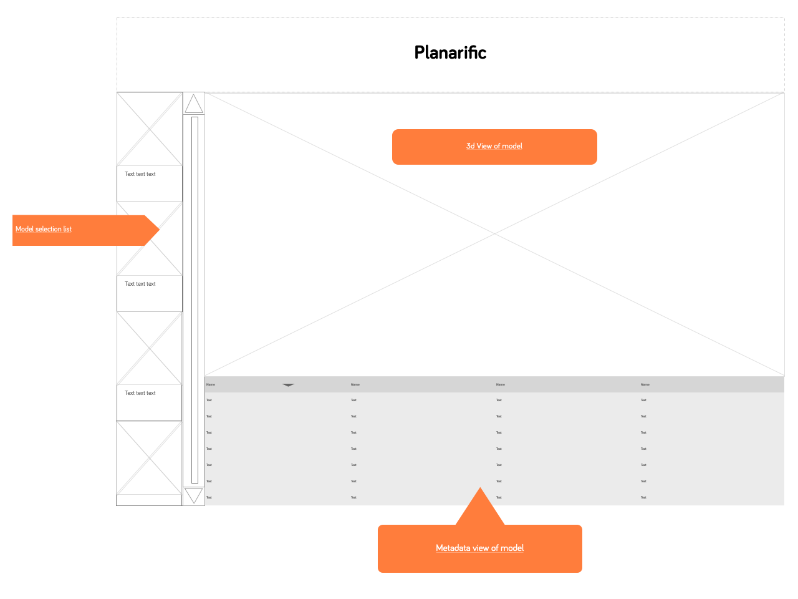

# Front-end developer test server: UX brief

We would like you to implement a simple web UI which can display "models" from the provided API. A "model" is a 3D representation of a building, along with some metadata.

## User stories

*As a user*, I should be able to view a list of models.

*As a user*, I should be able to select a particular model, in order to view its detailed metadata and view it in 3D.

*As a user*, I should be able to pan, tilt and zoom the 3D representation.

*As a user*, I should be able to reset the 3D representation if I get lost.

*As a user*, I should be able to switch to a different model's 3D representation and metadata.

## Bonus stories for high achievers
*As a user*, I should be able to click on a point and view its 3D coordinates.

*As a user*, I should be able to toggle between textured and wireframe representations.

Anything else you can think of to demonstrate your mastery of the genre!

## Wireframe

Just a guide, but maybe something like: 

